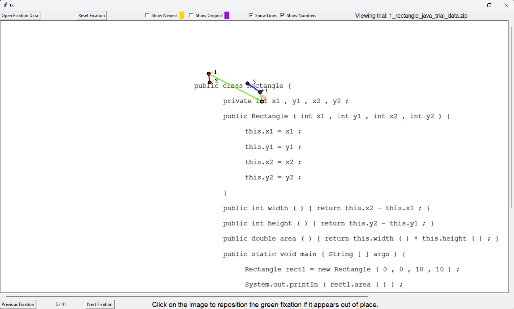

# Fixation Correction Verification

## Synopsis

When performing an eye tracking study, many imperfections with the technology and the physiology of a study participant can cause recorded data to be inaccurate. It is often the case in determining the location of an participants fixation on the screen (specific locations of focus on some stimulus presented on a display) that the data points must be moved or repositioned to more likely locations.

## Data representation

The image below is a screenshot representing eye tracking data in the eye-validate gui application.

The light red collection of dots ( looks like a red smear) indicates the locations of all the the raw gaze samples that were used by a fixation detection algorithm to position a fixation on the stimulus. Each of the solid dots outlined in black are fixations. The lines between each fixation are saccades or eye movment transitioning from one fixation to another. The green fixation dot is the current data point that needs to be examined for positioning on the stimulus. The other red and blue dots are also fixations, but they respectively represent the previous and subsequent fixations relative to the current fixation data point (green dot) and are numbered accordingly (`-` for previous and `+` for subsequent). The red, blue, and green saccade lines are color coded to the fixations and show the general movement trend of the participant's fixations.

## Evaluation Example

Determining the "correct" location of a fixation relies on observing of the location of the raw gazes (light red dots) used to calculate the fixation, the movement trend of the fixations, and the most likely content of interest within the stimulus. While there are some determinations that rely on intuition for some corrections, a simple example along the details used in the visual representation are presented to help.

Consider the image below to help illustrate correcting fixation locations.

In this image, the current fixation under consideration (green dot) has fallen on blank whitespace. While this location is precisely located at the center of the raw gazes (light red dots), remember that a fixation is an area that a participant has spent time observing steadily. Given this, it is unlikely that the participant was staring in the empty space. We could consider the nearest textual token to the fixation such as in the image below.

This location is better as we are now positioned within the Rectangle constructor in the stimulus content, but once again, it is unlikely that the participant was staring at the whitespace between two tokens. From observing the previous (red) and subsequent (blue) fixations it appears that the previous fixations that the user was scanning the Rectangle constructor line above them and the subsequent fixations trend toward left and downward in the stimulus. Considering these movement trends, it is likely that the current fixation (green dot) belongs on the line with the Rectangle constructor, but needs could be shifted to the left to follow the subsequent (blue) fixation movement trend. Also from observing the raw gazes we can see that the trend smudes down and to the left much like the fixation movement for the subsequent points.

The image below represents the new positioning based on the aforementioned factors.

## Interface Usage

The image below represents the graphical interface of the eye-validate application.

In addition to representing eye tracking data as described in "Data Representation", the interface allows for additional interactions and data presentation options. Once a zip file containing eye tracking trial data is opened, the interface will display the stimulus and the first set of data in the trial. The previous and next fixation buttons allow for iterating through the dataset and presenting the assciated fixation information. If a current fixation (green dot) does not appear in a location that seems reasonable, clicking on any location in the image stimulus will move the data point to that location and save the changed position data. Sometimes is it helpful to see other possible fixation positions. The checkboxes along the top can supplement the visualization by showing the:

* Original position which is the initial fixation position without any modifications

* Nearest position which snaps to the closest character in a textual token (does not consider previous or subsequent fixations)

Each of these positions are represented by the color to the immediate right of the respective checkboxes. It is important to note that due to the order in which this data is drawn if a dot does not appear it is most likely that it is covered by one of the other positions. For example, the nearest (yellow) and current (green) positions are assigned to the same location by default, if the nearest checkbox is enabled only the current position will be seen as it is drawn after (on top of) the nearest position data.

## Basic Usage Steps

1. Open a zip file containing trial data

2. Examine the position of the current fixation

3. Use all available visualization data to determine if the position is reasonable

4. If the position should be relocated, simply click the image where the current fixation should be moved

5. Move to the next fixation

6. Repeat steps 3-5 until the stimulus image disappears. The validation data is automatically written to the same director of the trial data file

7. Upload validation data to Google Drive

## Keyboard Shortcut Quick Reference

* o = Open a new trial data zip file (equivalent to the Open Fixation Data button)

* r = Reset the current fixation to the adjusted position (equivalent to the Reset Fixation button)

* a = Move backwards in the dataset to the previous fixation (equivalent to the Previous Fixation button)

* d = Move forwars in the dataset to the next fixation (equivalent to the Next Fixation Button).

* 1, 2 = Toggle Nearest and Original data checkboxes respectively

* 3, 4 = Toggle show lines and show numbers checkboxes respectively

* Mousewheel = Scroll the canvas vertically if necessary

* `shift` + Mousewheel = Scroll the canvas horizontally if necessary

## Setup

Once you have cloned the eye-validate repository to your computer, you will need to make sure that you have Python 3 installed on your system. Eye-validate also requires a few third party python libraries that can be installed using `pip install -r requirements.txt`. The libraries can be install in a [virtual environment](https://docs.python.org/3/tutorial/venv.html) or globally. Once you have the prerequisites met, simply run `python eye_validate_gui.py` from the project directory cloned from GitHub to launch the interface and begin dataset validation. 

The default application size is 1400x750 to accomodate smaller displays. Since all stimulus images are 1920x1080, this will require using the scrollbars from time to time. If you have a higher resolution display, you can edit the `settings.txt` file to manually change the display dimentions of the application and eliminate the need to scroll.

## Output

Each time you complete a dataset, you will get a `.tsv` and a `.json` file named after the trial zip file you have loaded. These files contain the results of your validation and will need to be stored somewhere safe.

## Limitations

* You **must** launch the gui application from it's root directory. Using an absolute or relative path that launches the application from another working directory will cause the application to not be able to locate important supporting files.

* The `.tsv` and `.json` files produced during the validation are saved to the same directory where you loaded the trial data zip file and cannot be changed at this time through the interface.

* The adjusted data fixation points (green dots) and the saccade lines that connect to it (green lines) are drawn on top of all other lines and dots to increase visibility. It is possible that these data points may obscure other visualized data.

* Previous data fixations (dark red dots) **always show the original location determined by the fixation detection algorithm**. This is by design to avoid introducing excessive skewing/bias to the fixation correction process.

* When you correct a green fixation location, that new location is recorded on mouse click and saved automatically in an output file once the next fixation button (or the `d` key) is pressed after viewing the last fixation in the trial and the stimulus image disappears.
